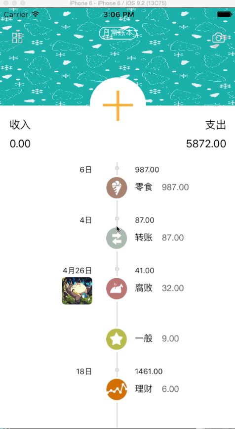
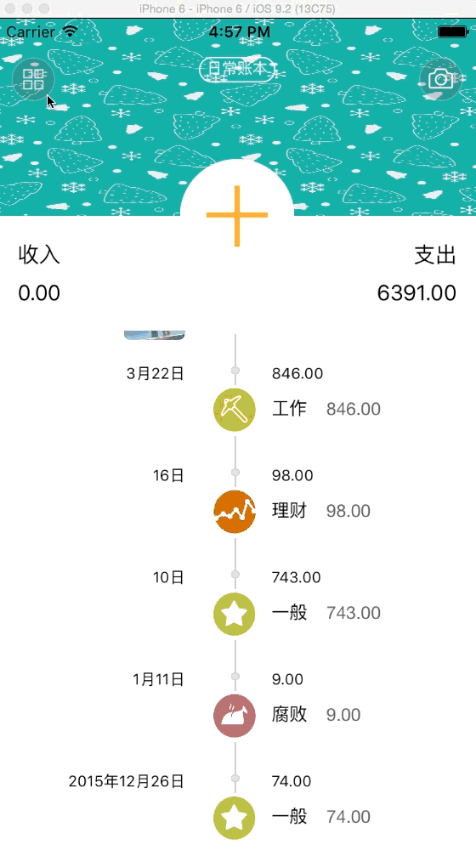
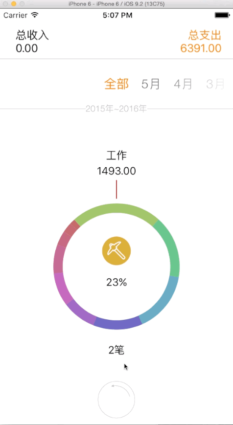
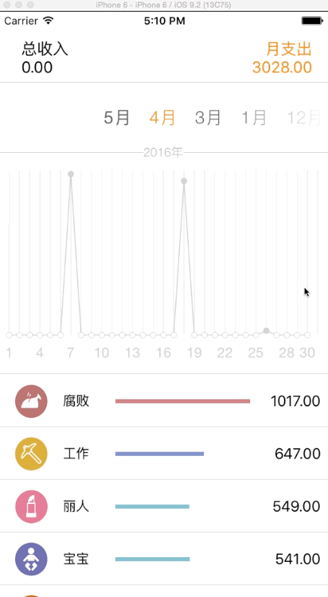

# KeepAccounts

高仿TIMI记账

# 开发环境

- Xcode 7.2
- CocoaPods v0.39.0 
- swift 2.1.

## 简介

KeepAccounts是一款工具类的App，提供了最基本的记账功能，所有账目都可以用饼状图或者折线图来显示。图片的素材均来自TIMI记账。

## 基本记账功能

 
点击首页的加号可以进入记账页面，提供了改时间、写备注和加照片三项小功能，以及自定义了一个计算器，可以进行简单的相加操作。

## 账本的操作

 
账本可以进行添加、删除、修改操作，用的是collectionview进行布局。

## 饼状图显示账目

 
饼状图显示的是每个月的支出分类，通过点击下方的按钮可以查看每一个分类。

## 折线图显示账目

 
折线图比较有意思的地方在于，按住图表之后可以显示当月每天的支出情况。这个折线图集成到工程之后有个小bug，感兴趣可以看看。

以上为主要功能，用到的第三方库有：
- RESideMenu
- FMDB
- AKPickerView

工作压力不大，所以做出来这么个小demo，还有挺多地方需要完善的，不过接下来公司要开始新项目了，所以暂时不做，等以后有时间再进一步完成。

